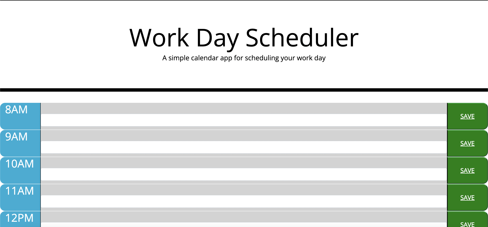
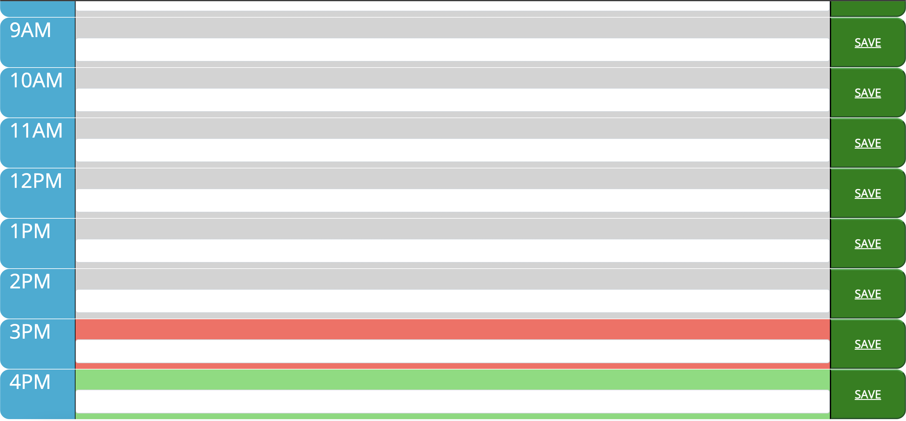
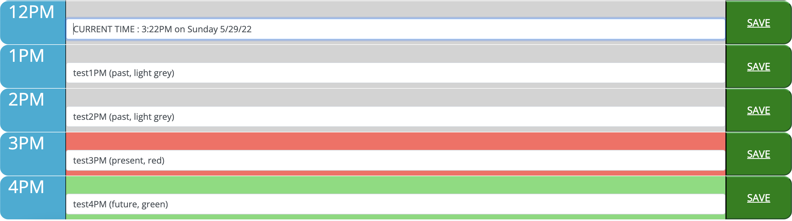
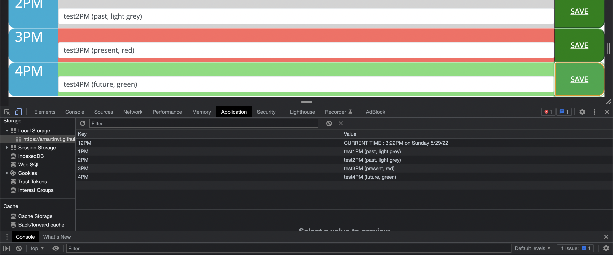

DEV INFO
---
Name: Adam Martin

Homework Title: Work Planner Web-App

Due Date: 5/29/2022

LINKS
---
GIT REPO: https://github.com/AmartinVT/DayScheduler

GIT PAGE: https://amartinvt.github.io/DayScheduler/

PROGRAM DESCRIPTION
---
Using 3rd party APIs such as Bootstrap, jQuery, and moment, this application serves as a simple day-planner for work from 8AM-4PM.

This planner app takes free-form user input for each hour 8AM to 4PM.

The user can then click the corresponding "SAVE" button for any given time row to save their free-form input.

That input is then stored in local browser storage allowing the planner to persist it's data as long as the browser session is not ended.

Deleting out content in any given field, entering new content, and pressing the corresponding "SAVE" button will over-write local storage.

The planner also formats the background colors of each time-slot row:
    
    - Times in the PAST are light-grey
    
    - The CURRENT time is red
    
    - Times in the FUTURE are light-green

SCREENSHOTS
---

